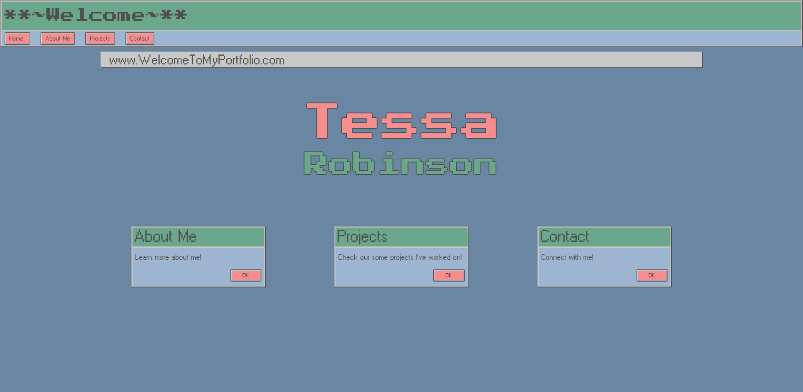

# Tessa Robinson Portfolio

### Personal website and portfolio of my web development projects. Learn a little bit about me, check out some apps I've worked on, or reach out through one of my socials or directly through the site!
 
View deployed site at: https://tessie-the-messy.github.io/Portfolio/#/
 

 

## Technologies/Frameworks
  - [React](https://reactjs.org/)
  - [Bootstrap](https://getbootstrap.com/)
  - [Windows 95 UI Kit](https://themesberg.com/product/ui-kit/windows-95-ui-kit)
  - [EmailJS](https://www.emailjs.com/)

## License: MIT license

    For more information visit https://opensource.org/licenses/MIT

## Contact

    For any questions or concerns, you can reach me at: tessa.elise.robinson@gmail.com
    To view my github profile, and other projects, please visit: github.com/tessie-the-messy
